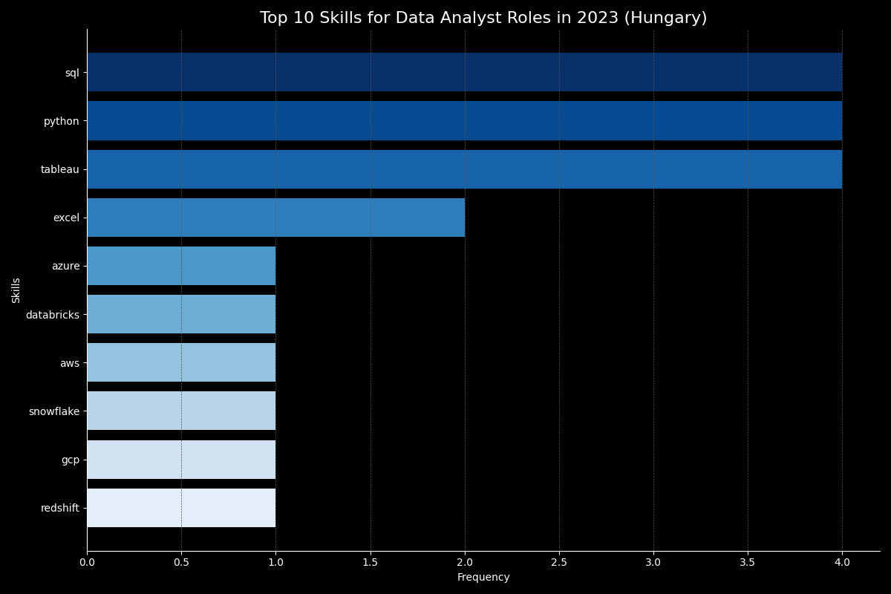

# Introduction
Explore Hungary's data job market! This project examines top-paying entry-level data analyst roles, essential and in-demand skills, and identifies where high demand meets high salary in data analytics. Discover the optimal skills to pursue for a rewarding data analyst career in Hungary.

You will find the SQL queries here: [project_sql folder](/project_sql/)

# Background
This is my capstone project for the [SQL for Data Analytics](https://www.lukebarousse.com/sql) course of [Luke Barousse](https://github.com/lukebarousse) and [Kelly Adams](https://github.com/kellyjadams), a way for me to showcase my skills in **SQL** querying, managing **GitHub repositories**, and a bit of **Markdown**.

Based on the queries in the course material, my five queries aim to answer questions about the Hungarian data job market, with a focus on entry-level Data Analyst jobs.

### The questions:

1. What are the top-paying data analyst jobs in Hungary?
2. What skills are required for the top-paying data anatyst jobs in Hungary?
3. What are the most in-demand skills for entry level Data Analysts?
4. What are the top skills for entry level analysts based on salary?
5. What are the most optimal skills to learn (aka it's in high demand and a high-paying skill) as an entry level analyst?

The data used in the project was provided in the course and sourced from Luke's [datanerd.tech](https://datanerd.tech/) app, which is designed to assist aspiring data professionals in identifying the most sought-after skills across various data-related professions.

# Tools I Used

For my analysis (and learning) I utilized the following tools:

- **SQL**: The main tool of my analysis, the language allowing me to query the database and answer my questions.
- **PostgreSQL**: The software provided me with a platform and access to the database I worked on
- **Visual Studio Code**: The code editor I choose whenever I need to write any SQL scripts and have the chance to use it.
- **Git and GitHub**: A crucial version control tool that makes sharing my SQL scripts, analyses possible, and helps with project tracking and future collaboration.
- **ChatGPT**: Helped me summarize and make my insights clearer, and also a great time saver when it comes to repetitive tasks and formatting.

# The Analysis
In this project, the queries are aimed to explore the data analyst job market with entry level jobs and Hungary in mind.

## 1. Top paying Data Analyst jobs in Hungary
This query retrieves data analyst job postings specifically in Hungary, filtering by job title, location, and ensuring salary information is available. It emphasizes top-paying opportunities within the data analyst profession in Hungary.

```sql
SELECT
    job_id,
    job_title,
    job_location,
    job_schedule_type,
    salary_year_avg,
    job_posted_date,
    name AS company_name
FROM
    job_postings_fact
    LEFT JOIN company_dim ON job_postings_fact.company_id = company_dim.company_id
WHERE
    job_title_short = 'Data Analyst'
    AND job_location LIKE '%Hungary%'
    AND salary_year_avg IS NOT NULL
ORDER BY
    salary_year_avg DESC
LIMIT 10;
```
### Insights from the results of this query

- **Wide Salary Range**: Top-paying data analyst roles in Hungary range from $155000 to $80850 per year, highlighting varied salary levels within the field.

- **Diverse Employers**: Companies such as OTP Bank, Gedeon Richter Pharma GmbH, and Prezi are among those offering competitive salaries, demonstrating diverse opportunities across different organizations.

- **Job Title Variety**: From Data Architects to Data Analysts and roles like Sustainable Farming Data Manager, the job titles reflect diverse responsibilities and specializations within the data analytics domain in Hungary.

## 2. Skills for Top Paying Data Jobs in Hungary

The query retrieves associated skills for each of the top-paying jobs. This provides insight into the specific skills sought after by employers offering competitive salaries in the data analyst field in Hungary.

```sql
WITH top_paying_jobs AS (
    SELECT
        job_id,
        job_title,
        salary_year_avg,
        name AS company_name
    FROM
        job_postings_fact
        LEFT JOIN company_dim ON job_postings_fact.company_id = company_dim.company_id
    WHERE
        job_title_short = 'Data Analyst'
        AND job_location LIKE '%Hungary%'
        AND salary_year_avg IS NOT NULL
    ORDER BY
        salary_year_avg DESC
    LIMIT 10
)

SELECT
    top_paying_jobs.*,
    skills
FROM
    top_paying_jobs
INNER JOIN skills_job_dim ON top_paying_jobs.job_id = skills_job_dim.job_id
INNER JOIN skills_dim ON skills_job_dim.skill_id = skills_dim.skill_id
ORDER BY
    salary_year_avg DESC;
```
### Results of the query:


### Insight generated from the results by ChatGPT
The most sought-after skills are SQL, Python, and Tableau. Familiarity with cloud platforms like Snowflake and Azure, as well as strong data visualization and analysis tools, are highly valuable.


*Bar graph visualizing the top 10 skills for Data analyst roles in Hungary; generated by ChatGPT from my SQL query results*

## 3. In-Demand Skills for entry level Data Analysts

The query identifies the most in-demand skills for entry-level data analyst positions with job titles containing 'Entry' or 'Junior'. It counts the occurrences of each skill across job postings and ranks them by demand count in descending order. The query is limited to showing the top 5 skills that are most sought after in this segment of the data analyst job market.

```sql
SELECT
    skills,
    COUNT(skills_job_dim.job_id) AS demand_count
FROM job_postings_fact
INNER JOIN skills_job_dim ON  job_postings_fact.job_id = skills_job_dim.job_id
INNER JOIN skills_dim ON skills_job_dim.skill_id = skills_dim.skill_id
WHERE
    job_postings_fact.job_title_short = 'Data Analyst'
    AND (job_postings_fact.job_title ILIKE '%Entry%'
         OR job_postings_fact.job_title ILIKE '%Junior%')
GROUP BY
    skills
ORDER BY
    demand_count DESC
LIMIT 5;
```

### Insights from the results of this query

The top skills in demand for entry-level data analyst roles include **Excel**, **SQL**, **Python**, **Tableau**, and **Power BI**. These skills are crucial for data manipulation, querying databases, and visualizing data, reflecting essential competencies sought by employers in the field.

| Skills   | Demand Count |
|----------|--------------|
| Excel    | 3,140        |
| SQL      | 2,997        |
| Python   | 2,102        |
| Tableau  | 1,660        |
| Power BI | 1,524        |

*Table of the demand for the top 5 skills in entry level data analyst job postings*

## 4. Skills Based on Salary

This query calculates the average salary for entry-level data analyst positions. It identifies the top skills associated with these roles based on average salary, providing valuable insights into the correlation between skills and compensation in the entry-level data analyst job market.

```sql
SELECT
    skills,
    ROUND(AVG(salary_year_avg), 0) AS avg_salary
FROM job_postings_fact
INNER JOIN skills_job_dim ON  job_postings_fact.job_id = skills_job_dim.job_id
INNER JOIN skills_dim ON skills_job_dim.skill_id = skills_dim.skill_id
WHERE
    job_postings_fact.job_title_short = 'Data Analyst'
    AND (job_postings_fact.job_title ILIKE '%Entry%' OR
         job_postings_fact.job_title ILIKE '%Junior%')
    AND salary_year_avg IS NOT NULL
GROUP BY
    skills
ORDER BY
    avg_salary DESC
LIMIT 25;
```

### Insight from the results of this query:

- **Web Development**: HTML and CSS are essential for front-end web development, with high average salaries reflecting their demand even in this domain.
- **Software Development**: Java and C++ are prominent in software development, indicating the need of analysts proficient in building applications and systems.
- **DevOps and Infrastructure**: Technologies like Docker and Jenkins demonstrate their importance in DevOps practices and infrastructure management, supported by competitive average salaries.

| Skills       | Average Salary ($) |
|--------------|--------------------|
| tensorflow   | 96500              |
| css          | 95000              |
| html         | 95000              |
| spring       | 90125              |
| docker       | 90125              |
| jenkins      | 90125              |
| c++          | 90125              |
| java         | 88961              |
| php          | 86333              |
| outlook      | 84500              |

*Table of the average salary for the top 10 paying skills for entry level data analysts*

## 5. Most Optimal Skills to Learn as a Beginner Analyst

This query identifies and ranks the most sought-after skills for entry or junior-level Data Analyst roles based on job postings, focusing on skills with significant demand and high average salaries.

```sql
SELECT
    skills_dim.skill_id,
    skills_dim.skills,
    COUNT(skills_job_dim.job_id) AS demand_count,
    ROUND(AVG(job_postings_fact.salary_year_avg), 0) AS avg_salary
FROM job_postings_fact
INNER JOIN skills_job_dim ON  job_postings_fact.job_id = skills_job_dim.job_id
INNER JOIN skills_dim ON skills_job_dim.skill_id = skills_dim.skill_id
WHERE
    job_title_short = 'Data Analyst'
    AND (job_title ILIKE '%Entry%' OR
         job_title ILIKE '%Junior%')
    AND salary_year_avg IS NOT NULL
GROUP BY
    skills_dim.skill_id
HAVING
    COUNT(skills_job_dim.job_id) > 10
ORDER BY
    avg_salary DESC,
    demand_count DESC
LIMIT 25;
```

### Insights from the results of this query
- **SQL Proficiency**: SQL-related skills such as SQL, SQL Server, and SSRS are highly demanded among entry or junior-level Data Analyst roles, with SQL having the highest demand count.
- **Data Analysis Tools**: Tools like Tableau, Excel, and Power BI are also essential, reflecting their frequent use in data analysis tasks despite slightly lower average salaries compared to SQL skills.
- **Programming Languages**: Python and R continue to be valuable skills, demonstrating strong demand and competitive average salaries in the data analyst job market.

| Skill       | Demand Count | Average Salary ($) |
|-------------|--------------|--------------------|
| Oracle      | 17           | 72,941             |
| NoSQL       | 13           | 70,154             |
| SQL Server  | 13           | 66,968             |
| Python      | 43           | 66,326             |
| R           | 24           | 66,271             |
| SQL         | 95           | 66,044             |
| SSRS        | 12           | 65,757             |
| SSIS        | 12           | 65,757             |
| VBA         | 15           | 65,280             |
| Sheets      | 11           | 64,448             |

*Table of the most optimal skills for entry level data analysts sorted by salary*

# What I learned

- Refreshed my knowledge of databases and SQL
- Learned and practiced advanced querying techniques such as subqueries and CTEs
- Utilized Git and GitHub not only for version control but also to showcase my work

# Conclusions

### Insights

1. **Top-Paying Data Analyst Jobs in Hungary**: Top-Paying Data Analyst Jobs in Hungary offer diverse salary ranges from $155,000 to $80,850, reflecting significant compensation diversity in the field.

2. **Essential Skills for High-Paying Jobs**: SQL, Python, and Tableau are crucial for top-paying data analyst roles in Hungary, emphasizing their importance in database management, programming, and data visualization.

3. **Most In-Demand Skills for Entry-Level Data Analysts**: Excel, SQL, Python, Tableau, and Power BI are key skills for entry-level data analysts, essential for data manipulation, querying databases, and visualizing data.

4. **Skills Associated with Higher Salaries**: Proficiency in HTML, CSS, Java, and C++ commands higher salaries, highlighting their importance in the skillset of a beginner Data Analyst.

5. **Optimal Skills to Maximize Market Value**: SQL proficiency stands out as the most sought-after skill, offering both high demand and competitive average salaries even in the entry level data analyst job market, making it crucial for aspiring analysts to enhance their market value.

### Closing thoughts

I wasn't a complete beginner when starting the course that culminated in this project. Nevertheless, working on it not only helped me learn new things about SQL and GitHub but also deepened my understanding of concepts I already knew. I feel that working on this project helped me realize why I initially started delving into data analysis and inspired me to embark on new projects of my own.